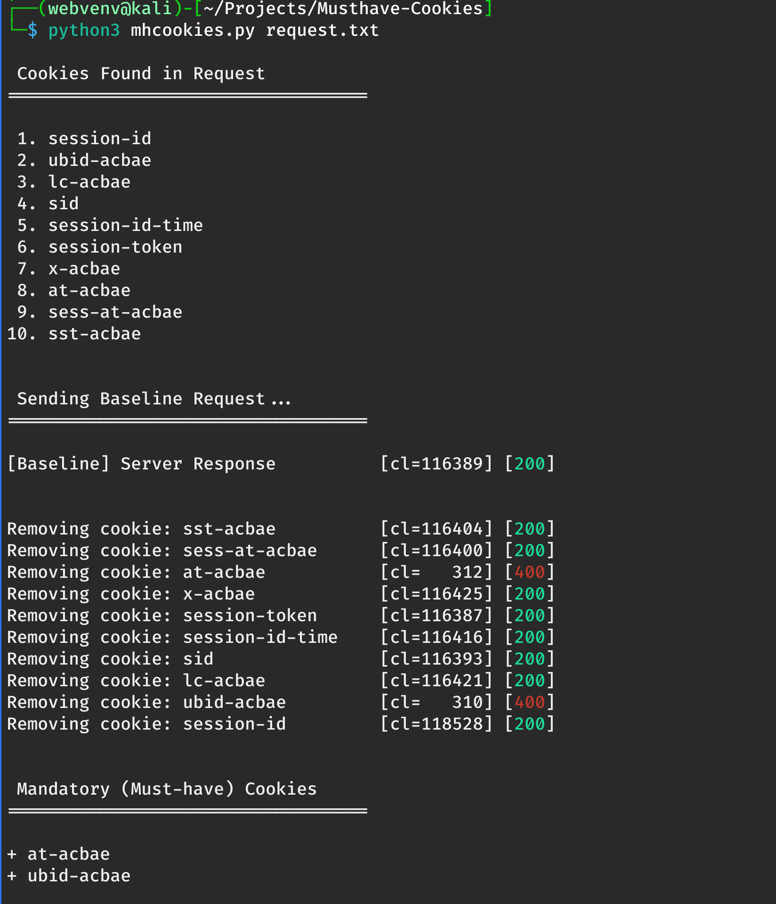

# Musthave Cookies

Musthave Cookies is a CLI tool that allows you to quickly identify which cookies are actually required by the server to maintain session state, access authenticated resources, or avoid redirection/denial responses.

<p align="center">
  
  <br/>
  <em>Musthave Cookies — Identify the cookies that actually matter</em>
</p>


## Purpose

When testing a new application, you’re often overwhelmed with 50+ cookies. 

This tool helps you immediately answer:

**Which cookies does the server actually depend on for this endpoint?**

Musthave Cookies systematically removes one cookie at a time and measures server response changes (status code + content length) to identify the minimum set of cookies required to maintain access.


## Installation

+ Python 3.6+

```
# Clone the repository
git clone https://github.com/webvenv/musthave-cookies.git
cd musthave-cookies

# Create and Activate virtual environment
python3 -m venv venv
source venv/bin/activate

# Install required package
pip install requests

# Run the tool
python3 mhcookies.py request.txt
```


## Usage

1. Copy a raw HTTP request (taken from Burp Suite/Caido) and paste it inside a text file: `request.txt`

*Inside `request.txt`...*

```
GET /path/endpoint?param=value HTTP/1.1
Host: sub.domain.com
Cookie: session-id=123-456; abcd-id=261-4866016; lc-acbae=en_US; sid="abcdefghijklmopqrstuvwxyz|1234567"; session-id-time=2379336985l; session-token="123-456-789"; x-acbae="a1b2c3d4e5f6g7"; at-acbae=ABC123DEF456; sess-at-acbae="0987654321zyxwuvt"; sst-acbae=5555-5555
Accept-Language: en-US,en;q=0.9
User-Agent: Mozilla/5.0 (X11; Linux x86_64) AppleWebKit/537.36 (KHTML, like Gecko) Chrome/136.0.0.0 Safari/537.36
Accept: text/html,application/xhtml+xml,application/xml;q=0.9,image/avif,image/webp,image/apng,*/*;q=0.8,application/signed-exchange;v=b3;q=0.7
Referer: https://sub.domain.com/
Connection: keep-alive
```

2. Pass the raw HTTP request file as an argument when executing the script.

```
python3 mhcookies.py request.txt
```

## Example Output




## Use Cases

I've found this tool especially useful when performing access control tests. It only takes a moment to paste the request into a text file and run the tool. Afterward, you'll know exactly which cookies are being processed by the server for that endpoint.

**Technical Use Cases:**

+ Reduce noise when testing
+ Quickly find session dependencies
+ Detect session fixation or fallback behaviors
+ Build automation pipelines with minimal cookie state


## Questions & Answers

*Wait, couldn't I just do this manually?*

Absolutely! And sometimes that might even be faster. 
But I've found that most of the time, it isn't.

---

*Why not just grep for session cookies by name? I've already memorized which cookies are important.*

You could, and that's awesome! But that only tells you what looks important. Musthave Cookies tells you what’s actually enforced by the server, regardless of naming convention.

---

*Can’t Burp Suite already do this?*

Yes — sort of. You can manually remove cookies in Repeater or use Burp macros/scripts. But Musthave Cookies automates the entire process and gives you a clean, aligned output with no setup required.

---


>"Here’s to the cookies that matter, the ones that don’t, and the server that always tells the truth."

Thank you for your time, and good luck, everyone!
